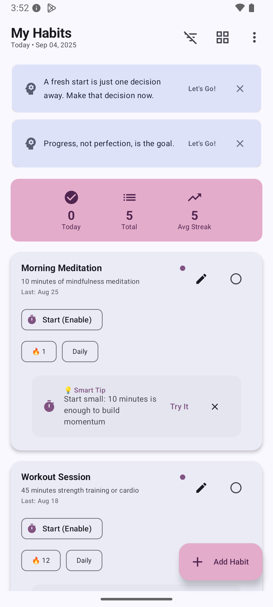

# 📱 Offline Habit Tracker - App Screenshots

This directory contains professional screenshots showcasing the key features and user interface of the Offline Habit Tracker Android application.

## 🖼️ Screenshot Gallery

### Main Interface
| Screenshot | Description |
|------------|-------------|
|  | **Home Dashboard** - Clean Material 3 design with today's habits overview, motivational nudges, and quick stats |
|  | **Habit Management** - Individual habit cards with timer functionality, streak tracking, and completion controls |
|  | **AI-Powered Insights** - Intelligent coaching tips based on user patterns and behavioral analysis |
|  | **Analytics Dashboard** - Comprehensive progress tracking with visual indicators and performance metrics |

## 🎨 Design Highlights

### **Modern UI/UX**
- ✨ **Material 3 Design System** with dynamic theming
- 🎯 **Clean Information Architecture** with intuitive navigation
- 🔄 **Smooth Animations** and micro-interactions
- 📱 **Responsive Layout** adapting to different screen sizes

### **Smart Features Showcase**
- 🧠 **Intelligent Nudges** with contextual motivational messages
- 📊 **Real-time Statistics** displaying today's progress and streaks
- ⏱️ **Smart Timing** with built-in habit timers
- 🎯 **Progress Tracking** with visual completion indicators

### **Professional Polish**
- 🎨 **Consistent Visual Language** across all screens
- ♿ **Accessibility Compliant** with proper contrast and touch targets
- 🔄 **State Management** with loading states and error handling
- 📐 **Proper Spacing** following Material Design guidelines

## 📋 Technical Implementation

These screenshots demonstrate:
- **Jetpack Compose** modern declarative UI
- **Material 3** design system implementation  
- **MVVM Architecture** with reactive state management
- **Room Database** integration with real-time updates
- **Hilt Dependency Injection** for clean architecture

---

*Screenshots captured on Android device running the latest build of Offline Habit Tracker v1.0*
